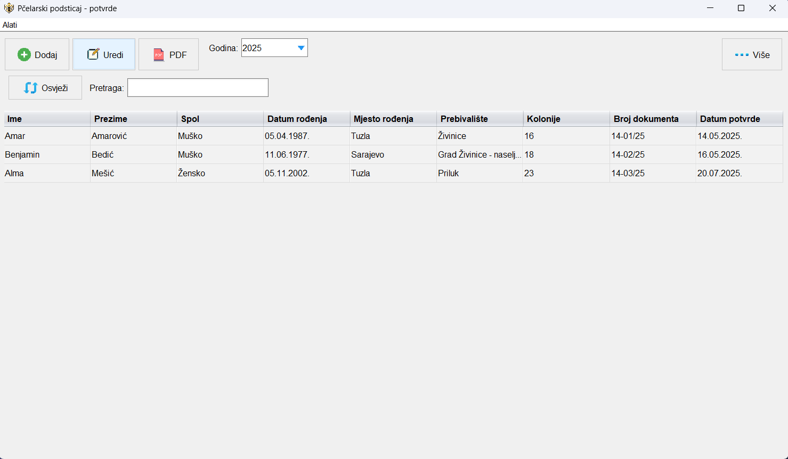
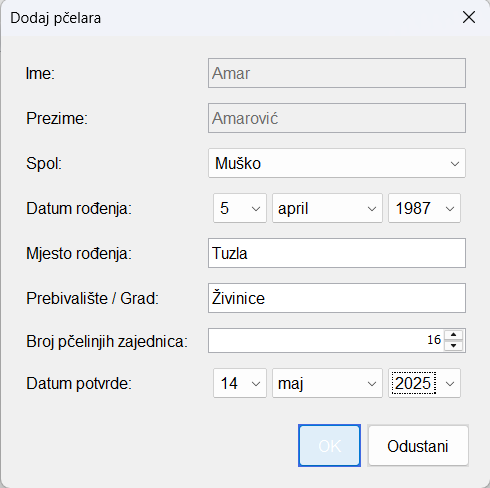
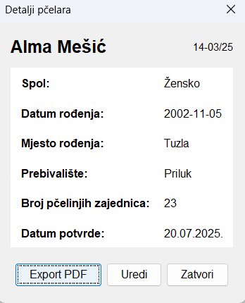
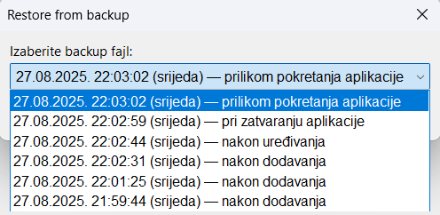

# 🐝 Beekeeper Incentive Certificate System  

A **Java Swing application** for managing beekeeper data and generating incentive certificates.  
This system helps organizations track beekeeper records, organize annual documentation and automatically produce **PDF certificates** for beekeeping subsidies.  

## ✨ Features  

- **Beekeeper Management** – Add, edit, and delete beekeeper records with detailed information  
- **Yearly Records** – Organize data by year with automatic certificate numbering  
- **Smart Import** – Reuse data from previous years to save time  
- **PDF Export** – Generate professional certificates ready for printing or archiving  
- **Backup & Restore** – Automatic snapshots plus manual backup/restore functionality  
- **Advanced Search** – Normalized search that ignores case and diacritics  
- **User-Friendly UI** – Clean interface with intuitive menus and toolbar actions  

## 🖼️ Screenshots  

Below are some screenshots demonstrating the main features of the application:  

### 🏠 Main Application Window  
  
*Overview of all registered beekeepers for the selected year.*  

### ➕ New Entry Dialog  
  
*Form for adding a new beekeeper to the database.*  

### 📋 Detail View Dialog  
  
*Comprehensive information about a beekeeper, including editable fields.*  

### 💾 Data Backup & Restore  
  
*Interface for restoring a previous snapshot of locally stored data.*  

## 🛠️ Tech Stack  

- **Java 24** – core programming language
- **Swing** – desktop user interface framework
- **Apache PDFBox** – PDF certificate generation (`pdfbox:3.0.5`)
- **OpenCSV** – CSV file handling (`opencsv:5.12.0`)
- **Gson** – JSON serialization/deserialization (`gson:2.13.1`)
- **Maven** – build automation and dependency management

## 📦 Installation  

1. **Prerequisites**  
   - Install [Java 24](https://openjdk.org/projects/jdk/24/) or newer  
   - Install [Maven](https://maven.apache.org/)  

2. **Clone the repository**  
   ```bash
   git clone https://github.com/your-username/beekeeper-incentive-system.git
   cd beekeeper-incentive-system
   ```

3. **Build the project with Maven**  
   ```bash
   mvn clean install
   ```

4. **Run the application**  
   ```bash
   mvn exec:java -Dexec.mainClass="com.pcelica.Main"
   ```

   Alternatively, import the project into your IDE (e.g., IntelliJ IDEA, Eclipse, NetBeans) and run `com.pcelica.Main`.  

## 🚀 Usage  

1. **Select a year** from the dropdown to load records  
2. **Add new beekeepers** with the ➕ button  
3. **Search records** via the search field  
4. **Double-click** a row to open detailed view/edit dialog  
5. **Export certificates** to PDF (single or batch)  
6. Access **Tools menu** for backup/restore and import/export  

## 📁 Project Structure  

```
src/
├── main/
│   ├── java/
│   │   └── com/pcelica/
│   │       ├── model/   # Data models (BeeUser)
│   │       ├── ui/      # UI components (MainFrame, dialogs)
│   │       ├── pdf/     # PDF generation (PdfExporter)
│   │       └── store/   # Persistence layer (DataStore)
│   └── resources/
│       ├── fonts/       # Custom fonts
│       └── icons/       # Application icons
└── test/                # Unit tests
```  

## 🔧 Configuration  

The app creates a local `data/` directory with:  
- `store.csv` – beekeeper database  
- `reserved_numbers.json` – reserved document numbers  
- `backup_*.csv` – automatic backups  

## ✉️ Contact  

[](https://www.linkedin.com/in/demir-halilbasic/) [](https://www.youtube.com/@DemkyDesignHub)  

## 👍 Feedback  

This project was developed in a very short timeframe for practical use.  
Accordingly, some bugs may occur during usage and improvements will be made over time, including the addition of new features.  

Your feedback on the **Beekeeper Incentive Certificate System** is highly appreciated.  
Please feel free to leave comments directly on the GitHub repository or contact me via LinkedIn.  

Thank you for your time and support! 🙏🐝
